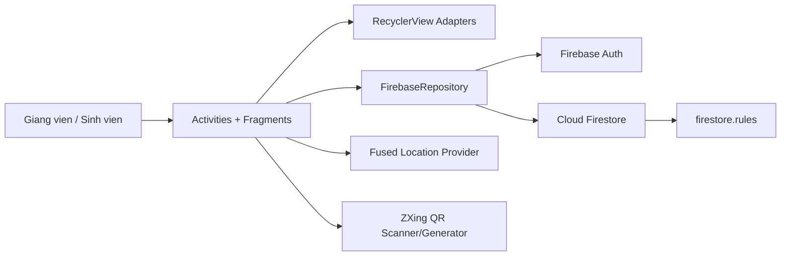
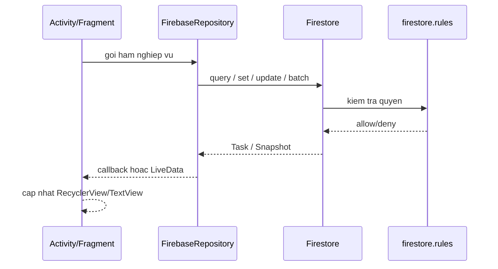
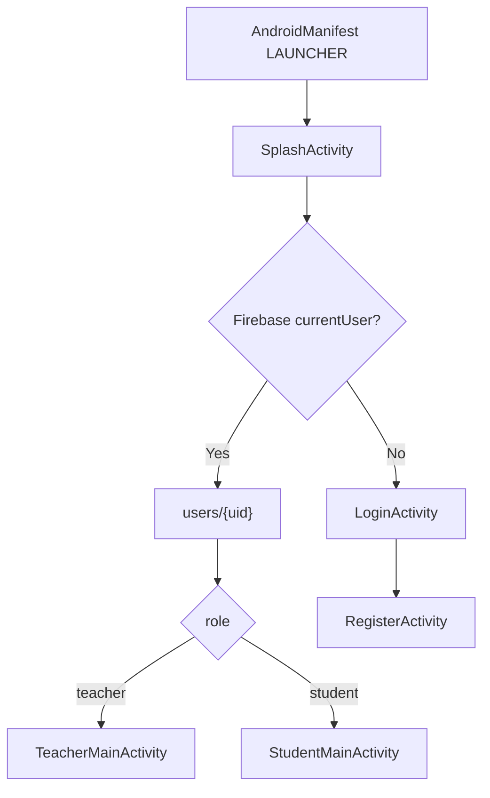
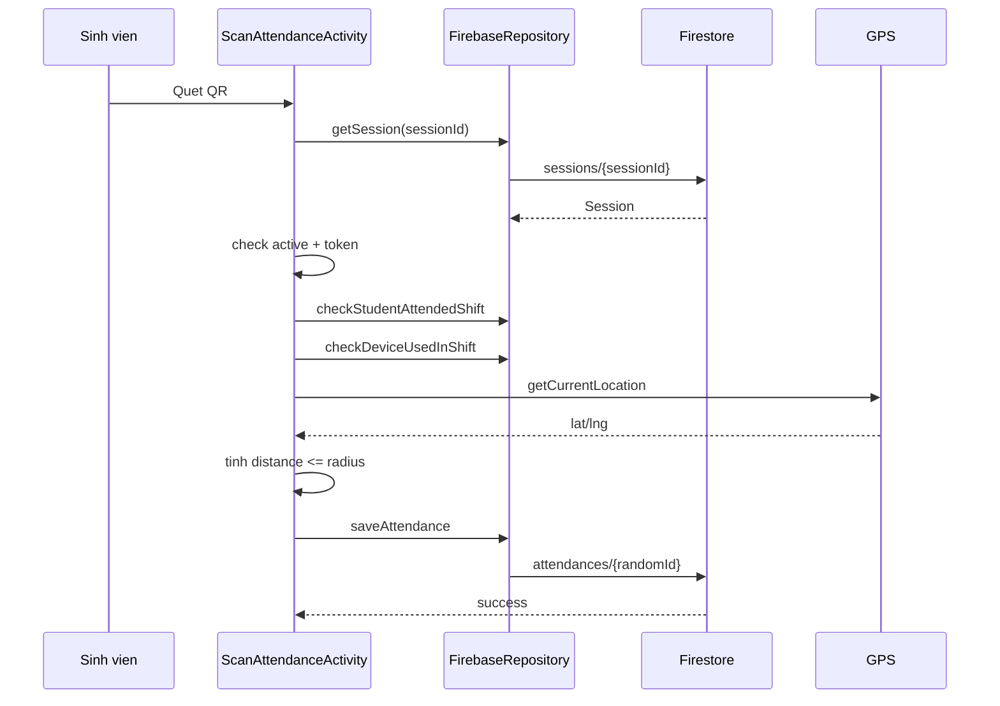

# Bao cao phan tich thiet ke he thong QR Attendance

Ngay phan tich: 25/06/2026  
Pham vi: doc source chinh trong `app/src/main`, `firestore.rules`, `firestore.indexes.json`, Gradle/Firebase config va resource XML. Khong tinh cac file sinh tu `build/`, `.gradle/`, `.idea/`

Link apk file: https://drive.google.com/drive/folders/1TDuyT3UZgG0aXtNaU6RXvYAy8FeokZ3R?usp=sharing
## 1. Tong quan he thong

QR Attendance la ung dung Android Java/XML dung de quan ly lop hoc va diem danh sinh vien bang QR code ket hop xac minh GPS. He thong co 2 vai tro chinh:

- Giang vien: tao lop, sinh lich hoc, quan ly sinh vien, mo/dong phien diem danh, xem danh sach diem danh realtime va thong ke.
- Sinh vien: dang ky/dang nhap, tham gia lop bang QR, xem lich hoc, quet QR de diem danh, xem lich su va ti le chuyen can.

Kien truc tong quat hien tai la mot Android client ket noi truc tiep Firebase:



## 2. Nen tang va cong nghe

Ung dung la single-module Android project:

- Module: `:app`
- Package/namespace: `com.example.attendanceapplication`
- `compileSdk`: 34, `minSdk`: 24, `targetSdk`: 34
- Ngon ngu: Java, UI XML, ViewBinding duoc bat nhung phan lon code van dung `findViewById`
- Backend: Firebase Auth, Firestore, Firebase Messaging, Firebase Storage/Firebase Database dependencies
- Thu vien UI/chuc nang: Material Components, RecyclerView, ViewPager2, MPAndroidChart, MaterialCalendarView, ZXing, Play Services Location, Lottie, ThreeTenABP

Mot so dependency da khai bao nhung chua co luong su dung day du trong source hien tai: Room, Firebase Storage, Firebase Realtime Database, ML Kit Face Detection, CameraX, Glide, FCM push token.

## 3. Cau truc source

```text
app/src/main/java/com/example/attendanceapplication/
|-- AttendanceApplication.java
|-- activities/
|-- fragments/
|   |-- teacher/
|   |-- student/
|   `-- shared/
|-- adapters/
|-- models/
|-- repositories/
`-- utils/
```

Nhan xet thiet ke:

- `models/` la cac POJO map truc tiep voi Firestore.
- `repositories/FirebaseRepository.java` la lop trung tam cho Auth, CRUD Firestore, listener realtime, batch write va mot phan nghiep vu.
- `activities/` va `fragments/` dieu phoi UI, validation, dieu huong va nhieu logic nghiep vu.
- `adapters/` hien thi danh sach lop, ca hoc, sinh vien, attendance, lich su.
- `utils/` gom QR, GPS, tinh khoang cach, FCM.

## 4. Mo hinh lop Java chinh

### Model

| File | Vai tro |
|---|---|
| `User.java` | Ho so nguoi dung: `uid`, `studentCode`, `name`, `email`, `role`, `avatarUrl`, `createdAt`. Co hang so `teacher/student`. |
| `ClassModel.java` | Lop hoc: ma lop, ten lop, giang vien, ngay bat dau/ket thuc, lich theo thu, phong, mo ta, si so. Ho tro `daySchedules` de moi thu co gio rieng. |
| `DaySchedule.java` | Khung gio hoc cho mot ngay trong tuan, quy uoc 2=T2 ... 8=CN. |
| `Shift.java` | Mot buoi/ca hoc: ngay, gio, phong, trang thai `upcoming/ongoing/completed/cancelled`, co mo diem danh hay khong, session gan voi shift. |
| `Session.java` | Phien diem danh: token QR, toa do giao vien, ban kinh, start/end time, active, noi dung buoi hoc, so phut cho phep muon. |
| `Attendance.java` | Ban ghi diem danh: sinh vien, session, shift, lop, toa do, khoang cach, thoi gian, status `present/late/absent`, deviceId. |
| `Enrollment.java` | Quan he sinh vien - lop, document id theo dang `studentId_classId`. |

### Repository

`FirebaseRepository.java` hien co hon 1000 dong va phu trach:

- Auth: login, register, get profile, sign out.
- Classes: tao/cap nhat/xoa lop, tu sinh shifts, kiem tra lop da co session.
- Enrollments: them/xoa/kiem tra sinh vien trong lop, lay danh sach sinh vien, lay ung vien chua ghi danh.
- Shifts: lay shift realtime, lay shift theo ngay, tao ca hoc bu, doi lich ca, cap nhat status.
- Sessions: tao phien thuong, tao phien bu, cap nhat late minutes, dong phien bang batch.
- Attendances: luu attendance, lay attendance theo lop/shift/sinh vien, listener realtime theo session, kiem tra trung diem danh/device.

Day la cach di chuyen du lieu chinh:



## 5. Thiet ke du lieu Firestore

He thong dung cac collection top-level:

| Collection | Document id | Du lieu chinh |
|---|---|---|
| `users` | `uid` | Ten, email, ma SV/GV, role, avatar, createdAt |
| `classes` | `classId` | Ten lop, teacherId, teacherName, lich hoc, phong, mo ta, si so |
| `shifts` | `classId_yyyy-MM-dd` hoac `classId_date_millis` voi ca bu | Buoi hoc, ngay gio, room, status, attendanceOpened, attendanceSessionId |
| `sessions` | `session_classId_shiftId_timestamp` | Phien diem danh, QR token, GPS anchor, radius, start/end, isActive |
| `attendances` | random id | Ban ghi check-in cua sinh vien |
| `enrollments` | `studentId_classId` | Quan he sinh vien tham gia lop |

Chi muc Firestore da khai bao:

- `attendances(sessionId, checkinTime ASC)`
- `attendances(studentId, checkinTime DESC)`
- `attendances(studentId, classId, checkinTime DESC)`
- `shifts(classId, date ASC)`
- `classes(teacherId, createdAt DESC)`

Nhan xet:

- Data model de hieu, gan voi UI.
- `classes -> shifts -> sessions -> attendances` la chuoi du lieu cot loi.
- `attendance` dang dung random id nen chua co rang buoc duy nhat tu Firestore de chan sinh vien tao nhieu ban ghi cho cung mot shift neu client bi bypass.
- `studentName/studentCode` duoc denormalize vao `Attendance` de danh sach realtime hien thi nhanh, day la lua chon hop ly cho UI.

## 6. Phan quyen va security rules

`firestore.rules` hien co cac helper:

- `isSignedIn()`
- `isClassTeacher(classId)`
- `sessionData(sessionId)`
- `isEnrolled(classId)`

Quyen chinh:

- `users`: moi user dang nhap doc duoc tat ca users, chi ghi profile cua chinh minh.
- `classes`: user dang nhap doc duoc tat ca classes; tao/sua/xoa chi teacher so huu.
- `shifts`: user dang nhap doc; ghi chi teacher cua class.
- `sessions`: user dang nhap doc; ghi chi teacher cua class.
- `attendances`: user dang nhap doc; sinh vien chi tao attendance cho minh, status chi `present/late`, phai enrolled, session active, classId/shiftId khop session; update chi teacher cua class; delete bi cam.
- `enrollments`: user dang nhap doc; sinh vien tu join hoac teacher cua class them sinh vien; teacher update; student/teacher duoc xoa tuy truong hop.

Danh gia:

- Rules da gan quyen ghi theo teacher owner va validate attendance voi session active, tot hon viec chi tin client.
- Quyen doc dang kha rong: moi user dang nhap co the doc users, classes, shifts, sessions, attendances, enrollments. Neu trien khai that, nen thu hep theo vai tro/lop ghi danh de giam lo ro ri du lieu.
- Rules chua chan attendance trung lap theo `studentId + shiftId` hoac deviceId. Cac check nay dang nam o client.

## 7. Luong khoi dong va xac thuc



`AttendanceApplication.onCreate()` khoi tao ThreeTenABP va FirebaseApp. App Check dang duoc comment la tat o client do enforcement dang tat tren Firebase Console.

## 8. Luong giang vien

### 8.1 Trang chinh va danh sach lop

`TeacherMainActivity` co bottom navigation:

- Home: `TeacherDashboardFragment`
- Classes: `TeacherClassListFragment`
- Calendar: `TeacherCalendarFragment`
- Profile: `ProfileFragment`

`TeacherDashboardFragment`:

- Lay profile giang vien.
- Observe realtime classes theo `teacherId`.
- Hien tong so lop, buoi hom nay, so buoi cho mo.
- Lay shifts hom nay theo danh sach classId.
- Mo `SessionManagementActivity` neu buoi chua ket thuc; mo `ShiftAttendanceListActivity` neu buoi da completed.

`TeacherClassListFragment`:

- Observe classes realtime.
- Tim kiem lop theo ten/ma.
- Tao lop qua `CreateClassActivity`.
- Tao QR tham gia lop qua `ClassQRDialog`.
- Xoa lop neu chua phat sinh session.

### 8.2 Tao lop va sinh buoi hoc

`CreateClassActivity`:

- Nhap ten lop, ma lop, phong, mo ta, start/end date.
- Chon cac thu trong tuan bang chips.
- Moi thu co start/end time rieng qua `DaySchedule`.
- Validate ngay ket thuc sau ngay bat dau, moi thu co gio hop le.
- Goi `repo.createClass`.

`FirebaseRepository.createClass` ghi document class, sau do `generateShifts` sinh cac shift theo lich tu startDate den endDate.

### 8.3 Chi tiet lop giang vien

`ClassDetailTeacherActivity` dung `ViewPager2` voi 3 tab:

- `ShiftsTabFragment`: danh sach buoi hoc, mo diem danh, xem ket qua, doi lich.
- `StudentsTabFragment`: danh sach sinh vien, them/xoa sinh vien, loc theo ti le diem danh/vang, mo chi tiet sinh vien.
- `StatsTabFragment`: thong ke lop bang BarChart/PieChart.

Menu toolbar co:

- QR tham gia lop.
- Them ca hoc bu.
- Them sinh vien.
- Sua thong tin lop.

### 8.4 Mo, theo doi va dong phien diem danh

`SessionManagementActivity`:

- Lay `shiftId`, `classId`, `className`.
- Neu shift dang mo diem danh va co `attendanceSessionId`, load lai session cu.
- Neu chua co session, lay GPS hien tai cua giang vien lam tam diem danh.
- Tao `Session` voi token QR, toa do, radius 100m.
- Ghi session va update shift sang `ongoing/attendanceOpened=true` bang Firestore batch.
- Tao QR payload:

```json
{
  "sessionId": "...",
  "token": "...",
  "classId": "..."
}
```

- Lang nghe attendance realtime theo `sessionId`.
- Cho cap nhat `lateAfterMinutes`.
- Dong session: bat buoc nhap noi dung buoi hoc voi phien thuong, update session inactive va shift completed bang batch.
- Sau khi dong phien thuong, mo `ShiftAttendanceListActivity` de xem ket qua.

### 8.5 Danh sach ket qua va diem danh bu

`ShiftAttendanceListActivity`:

- Lay students cua lop.
- Lay attendances cua shift.
- Tinh danh sach da diem danh va vang.
- Hien nut diem danh bu khi shift da completed.
- Diem danh bu mo lai `SessionManagementActivity` voi `EXTRA_MAKEUP=true`; session bu dat startTime lui ve truoc `lateAfterMinutes` de moi check-in tinh la late.

## 9. Luong sinh vien

### 9.1 Trang chinh, lop hoc va lich

`StudentMainActivity` co bottom navigation:

- Home: `StudentDashboardFragment`
- Classes: `StudentClassListFragment`
- Calendar: `StudentCalendarFragment`
- History: `AttendanceHistoryFragment`
- Profile: `ProfileFragment`

`StudentDashboardFragment`:

- Lay profile sinh vien.
- Observe danh sach lop qua enrollments.
- Lay tat ca shifts cua cac lop.
- Loc buoi hom nay, hien nut diem danh neu dang mo.
- Tinh ti le diem danh tung lop va tong.

`StudentClassListFragment`:

- Observe danh sach lop da tham gia.
- Tim kiem lop.
- Lay teacherName neu class chua luu san.
- Tinh ti le attendance tung lop.
- Join lop bang `JoinClassActivity`.

`StudentCalendarFragment`:

- Hien lich hoc bang MaterialCalendarView.
- Dot decorator cac ngay co shift.
- Agenda theo ngay; shift dang mo co action scan.

### 9.2 Tham gia lop bang QR

`ClassQRDialog` tao QR payload:

```json
{
  "classId": "...",
  "type": "join"
}
```

`JoinClassActivity`:

- Scan QR bang ZXing.
- Parse `classId`.
- Lay class, hien bottom sheet xac nhan.
- Kiem tra enrollment da ton tai.
- Ghi enrollment moi neu chua tham gia.

### 9.3 Diem danh bang QR + GPS

`ScanAttendanceActivity`:

1. Xin quyen camera va GPS.
2. Scan QR payload tu giang vien.
3. Lay session tu Firestore.
4. Kiem tra session active.
5. Kiem tra token QR khop session.
6. Kiem tra sinh vien chua diem danh shift nay.
7. Kiem tra deviceId chua duoc dung cho shift boi sinh vien khac.
8. Lay GPS hien tai.
9. Tinh khoang cach bang Haversine voi toa do session.
10. Neu trong ban kinh 100m, tao attendance `present` hoac `late`.
11. Luu attendance, chuyen sang `AttendanceResultActivity`.



### 9.4 Lich su va chi tiet attendance

`AttendanceHistoryFragment`:

- Lay classes cua sinh vien.
- Lay completed shifts cua cac lop.
- Lay attendance history cua sinh vien.
- Gom nhom theo thang.
- Tinh total/present/absent/rate.
- Hien chi tiet khoang cach, thoi gian, toa do khi expand item.

`ClassDetailStudentActivity`:

- Hien thong tin lop, teacher, room, lich hoc.
- Observe shifts realtime.
- Gan attendance status vao tung shift.
- Tinh so buoi da qua, present, absent va ti le.

`ShiftDetailActivity`:

- Hien chi tiet mot shift.
- Neu co attendance, hien thoi gian, dung gio/muon, khoang cach.
- Neu co session va chua attendance, cho mo scan.

## 10. Thiet ke UI va resource XML

UI duoc chia theo activity/fragment layout:

- Auth: `activity_login.xml`, `activity_register.xml`, `activity_splash.xml`
- Main shell: `activity_teacher_main.xml`, `activity_student_main.xml`
- Teacher: dashboard, class list, class detail, shifts tab, students tab, stats tab, session management, shift attendance list
- Student: dashboard, class list, calendar, attendance history, class detail, shift detail, scan, result
- Dialog/bottom sheet: join class, class QR, add student, add makeup shift, edit class, reschedule shift

Thanh dieu huong:

- Giang vien: Trang chu, Lop hoc, Lich day, Ho so.
- Sinh vien: Trang chu, Lop hoc, Lich hoc, Lich su DD, Ho so.

Design system:

- Mau chinh: xanh `#0f50aa`
- Success: xanh la `#2E7D32`
- Warning: vang/cam `#F57F17`
- Error: do `#C62828`
- Card, badge, chip, progress indicator duoc dung de hien trang thai attendance.

## 11. Dong bo realtime

Co 3 nhom realtime chinh:

- Lop cua giang vien: `classes where teacherId orderBy createdAt`.
- Lop cua sinh vien: snapshot `enrollments`, sau do get classes.
- Shifts cua lop: `shifts where classId orderBy date`.
- Attendance trong phien: `attendances where sessionId`, listener realtime rieng co `ListenerRegistration` va remove trong `onDestroy`.

Nhan xet:

- Man hinh session cua giang vien cap nhat danh sach diem danh gan realtime.
- Viec mo/dong session dung batch giup shift va session nhat quan hon.
- Mot so LiveData trong repository tao Firestore snapshot listener nhung khong giu `ListenerRegistration` de remove khi inactive; neu tao nhieu LiveData theo vong doi man hinh co nguy co listener ton tai lau hon can thiet.

## 12. Diem manh thiet ke

- Tach ro cac entity cot loi: `ClassModel`, `Shift`, `Session`, `Attendance`, `Enrollment`.
- Luong nghiep vu phu hop bai toan: tao lop -> sinh shift -> mo session -> scan QR/GPS -> ghi attendance -> thong ke.
- Batch write duoc dung cho thao tac mo/dong session de giam trang thai nua voi.
- Security rules da rang buoc teacher ownership cho ghi class/shift/session va validate attendance voi session active.
- UI co du 2 vai tro, navigation rieng, lich, thong ke, lich su, chi tiet.
- Denormalize `studentName/studentCode` vao attendance giup danh sach realtime de render.
- Co xu ly ca hoc bu, doi lich, loc sinh vien theo ti le attendance/vang.

## 13. Rủi ro va van de thiet ke can chu y

### 13.1 Repository qua lon

`FirebaseRepository.java` gom Auth, data access, validation nghiep vu, batch, listener va helper. Khi he thong lon hon, file nay se kho test va kho bao tri. Nen tach thanh cac repository/service nho:

- `AuthRepository`
- `ClassRepository`
- `ShiftRepository`
- `SessionRepository`
- `AttendanceRepository`
- `EnrollmentRepository`

### 13.2 Nhieu logic nghiep vu nam trong Activity/Fragment

`SessionManagementActivity`, `ScanAttendanceActivity`, `StudentsTabFragment`, `ClassDetailStudentActivity` xu ly nhieu nghiep vu truc tiep. App da khai bao ViewModel/LiveData nhung chua dung theo mo hinh MVVM ro rang.

He qua:

- Kho unit test.
- Kho tai su dung logic.
- Callback long nested.
- UI thread va async state de gay loi khi fragment detach.

### 13.3 Refresh QR token chua ghi len Firestore //Đã fix

Trong `SessionManagementActivity.refreshQrCode()`, code chi cap nhat `currentSession.setToken(...)` va ve QR moi tren man hinh, nhung khong update token moi vao document `sessions/{sessionId}`. Sinh vien scan QR moi se lay session tu Firestore va so token voi token cu, co the bi bao QR khong hop le.

Nen them repository method update token va batch/transaction neu can.

### 13.4 Kiem tra trung attendance chu yeu o client

Client co `checkStudentAttendedShift` va `checkDeviceUsedInShift`, nhung `attendances` dung random document id va rules khong bat duy nhat theo `studentId_shiftId`.

Rui ro:

- Client bi sua co the tao nhieu attendance cho cung shift.
- Device anti-cheat fail-open khi query loi.

Huong sua:

- Dung attendance document id deterministic: `studentId_shiftId`.
- Rules chi allow create khi `attendanceId == studentId + '_' + shiftId` va document chua ton tai.
- Neu can anti-cheat nghiem tuc, dua len Cloud Functions/transaction server-side.

### 13.5 Query `whereIn` chua chunk o tat ca noi //đã fix

Firestore `whereIn` co gioi han so phan tu moi query. Code da chunk trong `getShiftsForClasses`, nhung mot so noi chua chunk:

- `getStudentClasses`: `whereIn(FieldPath.documentId(), classIds)`
- `getClassStudents`: `whereIn(FieldPath.documentId(), studentIds)`
- `getShiftsByDate`: `whereIn("classId", classIds)`

Neu sinh vien tham gia nhieu lop hoac lop co nhieu sinh vien, query co the loi. Nen dung chunk 10/30 tuy SDK limit hien hanh va merge ket qua.

### 13.6 Quyen doc Firestore rong

Rules cho user dang nhap doc gan nhu toan bo users/classes/shifts/sessions/attendances/enrollments. Voi moi truong that, thong tin diem danh va profile la du lieu nhay cam. Nen:

- Student chi doc lop da enroll, shift/session lien quan va attendance cua minh.
- Teacher chi doc lop minh so huu va attendance/enrollment cua lop minh.
- Users chi doc profile can thiet, hoac chi teacher duoc tim sinh vien theo workflow them SV.

### 13.7 GPS fallback 0,0 khi giang vien mo phien

`SessionManagementActivity.fetchLocationAndCreateSession()` neu khong lay duoc GPS thi tao session voi toa do `(0,0)`. Dieu nay co the lam phien diem danh sai vi sinh vien khong the o gan `(0,0)`, hoac tao du lieu rac. Nen chan mo phien khi khong co GPS, hoac bat giang vien thu lai/chon toa do co y thuc.

### 13.8 Token QR chua du manh ve mat bao mat

`AttendanceUtils.generateToken()` dung timestamp + `Math.random()`. Du dung cho demo, nhung nen dung `SecureRandom` va token co entropy cao neu trien khai that.

### 13.9 Mot so tinh nang khai bao nhung chua hoan thien

- `FCMService` chi log token, TODO luu token len Firestore.
- ML Kit Face Detection, CameraX, Storage, Room da khai bao nhung chua co luong thuc te.
- `CreateSessionActivity` va `SessionManagementActivityPlaceholder` la placeholder/legacy.
- `ClassDetailStudentActivity` co mock shifts khi Firestore khong co shift; nen tach demo data ra debug build hoac xoa trong production.

### 13.10 Kha nang test chua ro

Khong thay `app/src/test` va `app/src/androidTest` trong checkout. Code hien phu thuoc nhieu vao Firebase callback va Android UI nen nen them test cho:

- `AttendanceUtils`
- tinh lich/sinh shift
- tinh ti le attendance
- mapping status
- validation tao lop/doi lich
- rules Firestore bang emulator test

## 14. De xuat cai tien uu tien

1. Sua `refreshQrCode()` de persist token moi len Firestore.
2. Doi attendance id sang deterministic `studentId_shiftId` de chan ghi trung.
3. Chunk tat ca query `whereIn`, dac biet danh sach sinh vien/lop > 10.
4. Thu hep Firestore read rules theo teacher owner/enrollment.
5. Bo fallback session GPS `(0,0)`, yeu cau lay GPS thanh cong truoc khi mo phien.
6. Tach `FirebaseRepository` thanh cac service nho va dua logic man hinh sang ViewModel.
7. Quan ly `ListenerRegistration` trong repository LiveData de go listener khi inactive.
8. Them Firestore emulator tests cho rules va unit tests cho logic tinh attendance.
9. Loai bo placeholder/demo/mock khoi release flow.
10. Hoan thien FCM/App Check/face verification neu day la muc tieu bao mat.

## 15. Ket luan

He thong da co thiet ke du chay cho bai toan diem danh lop hoc bang QR + GPS: co role routing, tao lop, sinh lich hoc, tham gia lop, mo phien, scan diem danh, realtime monitoring va thong ke. Kien truc hien tai thich hop cho do an/prototype hoac ung dung nho, nhung can gia co o 3 diem neu dua vao moi truong thuc: bao mat Firestore rules, rang buoc duy nhat attendance, va tach business logic khoi Activity/Fragment/Repository lon.

Neu uu tien on dinh san pham, nen bat dau tu cac loi co tac dong truc tiep: QR refresh khong persist token, `whereIn` limit, duplicate attendance, va quyen doc qua rong.

